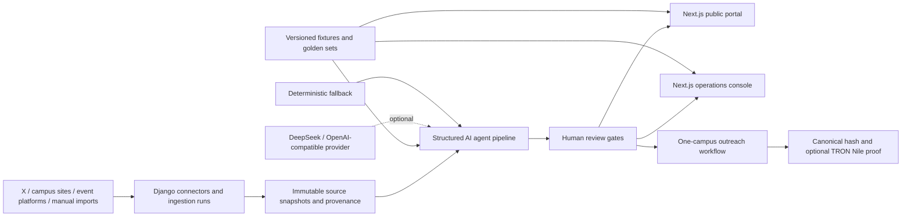
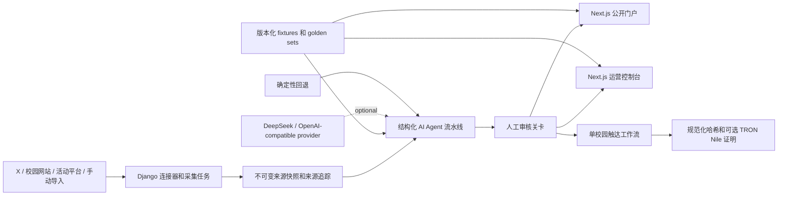

# ClawTree

### Evidence-grounded AI agents for trusted ecosystem partnerships
### 证据驱动的 AI Agent，构建可信生态合作
---

[](frontend)
[](backend)
[](contracts)
[](tests)
[](contracts/test)
[](#htx-ecosystem-integration)

**🌍 [GB English](#english) · [简体中文](#chinese)**

---

<a name="english"></a>

> ClawTree turns fragmented public signals into verified content, explainable partnership opportunities, human-approved outreach, and privacy-safe onchain proof.

Media teams, universities, hackathons, protocols, and ecosystem operators all face the same operational gap: the information needed to build partnerships is public, but scattered; AI can accelerate the work, but uncontrolled automation creates factual, privacy, and brand risk.

ClawTree closes that gap with an **AI-native partnership operating system**:

```text
Public sources
    -> provenance and deduplication
    -> structured AI analysis
    -> opportunity and proposal generation
    -> mandatory human approval
    -> outreach and reply workflow
    -> privacy-safe campaign proof
```

The repository uses the **TreeFinance campus tour as a reference demo workspace**. TreeFinance is not presented as a ClawTree customer, owner, or endorsement. The underlying workspace, agent, data, and proof architecture is designed for any media brand, ecosystem team, university network, or event operator.

## Why ClawTree

Most partnership workflows still live across browser tabs, spreadsheets, chat threads, and disconnected inboxes:

- Public events and collaboration signals are difficult to discover, verify, and reuse.
- Content, community, and business teams repeatedly research the same facts.
- Generic LLM outputs lack source-level evidence and can invent unsupported commitments.
- Fully automated publishing or outreach can damage a brand in finance, Web3, and campus settings.
- Sponsors and ecosystem partners receive reports, but rarely receive verifiable execution evidence.

ClawTree is not an event directory and not an AI bulk-mailer. It connects two reinforcing product loops:

| Product loop | Outcome |
|---|---|
| **Trusted Content Relay** | Public sources are collected, classified, deduplicated, risk-reviewed, human-approved, and published as accessible campus content. |
| **Opportunity-to-Proposal** | Verified campus events become explainable matches, three-tier proposals, one-recipient drafts, approval records, and campaign proof. |

## The 3-Minute Demo

The default demo is deterministic and works without a model key, database, mailbox, wallet, or public network.

1. A teacher opens `/user` and sees sourced campus recaps and AI/Web3 opportunities without needing to browse X.
2. The AI assistant answers from a reviewed knowledge base, shows citations, and hands uncertain or high-risk questions to a human.
3. An operator switches to `/admin` to inspect ingestion, deduplication, risk labels, editorial changes, and approval state.
4. ClawTree matches a campus opportunity against reviewed organizational capabilities.
5. The Proposal Agent generates light, medium, and deep collaboration options with claim-level evidence.
6. The Outreach Copilot creates a separate draft for one campus; nothing is sent before explicit approval.
7. ClawTree hashes a public campaign summary into a mock TRON Nile proof while excluding contacts, message bodies, replies, and prompts.

```bash
npm run install
npm run demo
```

Open [http://127.0.0.1:3000](http://127.0.0.1:3000).

| Surface | Purpose |
|---|---|
| [`/demo`](http://127.0.0.1:3000/demo) | Deterministic end-to-end hackathon story |
| [`/user`](http://127.0.0.1:3000/user) | Public portal for teachers and students |
| [`/admin`](http://127.0.0.1:3000/admin) | Operations, editorial review, proposals, and outreach |

## What Makes It Technically Different

### 1. Evidence is part of the agent protocol

ClawTree does not accept free-form model confidence as proof. Six agent tasks have strict JSON Schemas:

```text
classify -> deduplicate -> compliance -> match -> proposal -> reply triage
```

Every result must include:

- input `sourceIds`;
- claim-level evidence;
- bounded confidence or scoring;
- explicit review state;
- task-specific guardrails.

Invalid JSON, missing citations, unknown source IDs, or unsafe input fails validation and falls back to a deterministic provider.

### 2. External content is treated as untrusted data

Pages, posts, event descriptions, and imported text are wrapped as data, never as system instructions. The agent safety layer detects prompt-injection patterns and prevents source text from changing:

- tool permissions;
- recipients;
- approval requirements;
- system rules;
- proof payload fields.

The repository includes 12 prompt-injection fixtures and adversarial assistant tests.

### 3. AI cannot create real-world side effects by itself

The product separates recommendation from execution:

```text
AI may collect, classify, summarize, match, score, and draft.
Humans approve publication, delivery, commitments, and onchain writes.
```

The offline harness returns `externalSideEffect: false`. Real SMTP delivery and real wallet transactions require explicit configuration and user action.

### 4. Public and operational data have different boundaries

The public API uses explicit serializer allowlists. Public users never receive:

- contact emails or phone numbers;
- raw risk text or unpublished source content;
- internal scores or model prompts;
- outreach drafts or reply bodies;
- credentials or private proof inputs.

Admin workflows retain the provenance, review, and audit context needed to make responsible decisions.

### 5. The system is designed to degrade gracefully

External systems are adapters, not single points of failure:

| Dependency unavailable | Fallback behavior |
|---|---|
| LLM provider | Deterministic classification, matching, and proposal templates |
| Public web search | Reviewed RAG/FAQ response or human handoff |
| Database | Local fixture-backed demo APIs |
| Email provider | Draft or console mode; no silent delivery |
| Wallet or testnet | Deterministic mock proof |
| X or event source | Versioned golden fixtures |

This makes the demo reliable while preserving a path to a real pilot.

## AI Architecture

ClawTree uses a recoverable, sequential agent workflow instead of a group of unconstrained chat agents.

| Agent task | Structured output | Safety behavior |
|---|---|---|
| `classify` | Labels, confidence, evidence | Unknown content enters review |
| `dedup` | Canonical item, reason, confidence | Exact rules run before semantic logic |
| `compliance` | Risk level, safe summary, diff | High-risk content fails closed |
| `match` | Six subscores, fit, conflicts, missing facts | Recommendations remain explainable |
| `proposal` | Three tiers, resources, risks, questions | No unsupported prize, exposure, or investment promises |
| `reply` | Intent, confidence, next action | Ambiguous replies require human review |

The public assistant adds a separate bilingual RAG workflow with:

- reviewed and time-bounded knowledge entries;
- source citations and `knowledgeAsOf`;
- teacher/student interaction modes;
- policy refusals for unsupported commitments;
- consent-gated human handoff;
- deterministic no-key fallback.

## Web3 Architecture

ClawTree uses Web3 where immutability creates actual product value: proving that an approved public campaign action or aggregate impact snapshot existed at a specific point in time.

It does **not** place personal data onchain.

### Proof allowlist

The default proof route canonicalizes and hashes approved public fields such as:

```text
payloadVersion
workspaceId
draftId
universityName
eventTitle
approvedBy
approvedAt
approvalStatus
```

It excludes email addresses, names of contacts, message bodies, replies, private notes, prompts, and credentials. Repeated canonical inputs produce the same hash.

### Smart contracts

| Contract | Purpose |
|---|---|
| [`EventRegistry.sol`](contracts/contracts/EventRegistry.sol) | Register verified ecosystem events with controlled writers |
| [`OutreachRecord.sol`](contracts/contracts/OutreachRecord.sol) | Anchor outreach and reply hashes without exposing message content |
| [`TrendOracle.sol`](contracts/contracts/TrendOracle.sol) | Anchor aggregate campaign and trend snapshots |

The main demo uses a mock Nile proof for reliability. The repository also includes TronLink/OKX wallet detection, TRON Nile configuration, contract deployment scripts, and an explicit live proof path.

## HTX Ecosystem Integration

ClawTree addresses the hackathon requirement with concrete integration points rather than a logo-only narrative.

### Implemented in this repository

- **HTX market data:** the operations dashboard reads the public HTX market endpoint for the `$HTX/USDT` market card.
- **Genesis campaign intelligence:** the reviewed assistant knowledge base and golden dataset include the HTX Genesis Hackathon as a sourced ecosystem event.
- **Ecosystem growth workflow:** Genesis, grant, hackathon, and developer-program signals can become campus campaigns, partner proposals, approved outreach, and impact reports.
- **TRON proof layer:** Nile wallet support and Solidity contracts provide a Web3 execution-evidence path, with a deterministic mock fallback for the main demo.

### Expansion path

- Run extraction, matching, and proposal workloads on B.AI compute.
- Turn HTX ecosystem programs into reusable campaign workspaces.
- Add privacy-safe sponsor and grant milestone proofs.
- Use `$HTX` for approved campaign budgets, ecosystem rewards, or campus contribution incentives only after legal and anti-abuse review.

The key ecosystem contribution is not a price widget. It is an operating layer that helps HTX, B.AI, grants, protocols, and hackathons turn ecosystem programs into measurable campus and developer growth.

## Product Surfaces

### Public portal

- `/user/signals`: verified signals with fact/AI/editorial separation.
- `/user/events`: filtered campus events with public sources and registration links.
- `/user/recaps`: approved content relay recaps.
- `/user/about`: reviewed workspace capabilities and boundaries.
- `/user/cooperate`: consent-aware partnership handoff.
- AI assistant: bilingual RAG, citations, refusal, web lookup fallback, and human escalation.

### Operations console

- `/admin/ingestion`: connectors, runs, cursors, counts, failures, and cost fields.
- `/admin/content`: source text, clusters, risks, suggested edits, diffs, and review state.
- `/admin/events`: campus opportunity browser.
- `/admin/proposals`: evidence-backed matching and three-tier proposal review.
- `/admin/outreach`: individual drafts, approval, wallet state, and proof records.
- `/admin/reviews`: event and source recap management.

### Django pilot backend

The Django/DRF backend is more than a placeholder. It includes:

- workspace-scoped brand and capability evidence;
- university event ingestion and import commands;
- X/content relay connectors with run records and cursors;
- immutable content items and a fail-closed editorial state machine;
- separate public and admin serializers;
- outreach draft approval and optional SMTP delivery;
- SQLite for local use and environment-driven MySQL configuration.

## System Architecture



## Repository Layout

```text
ClawTree/
├── frontend/          Next.js 16 UI, route handlers, agent runtime, RAG, fixtures
├── backend/           Django 4.2 + DRF pilot backend and ingestion commands
├── contracts/         Solidity contracts, Hardhat tests, TRON deployment scripts
├── scripts/           Smoke, preflight, secret scan, docs, and offline harness
├── tests/             Node domain, boundary, privacy, route, and safety tests
└── docs/              PRD, architecture, acceptance criteria, tasks, and demo scripts
```

## Quick Start

### Requirements

- Node.js `20.9+` (Node.js 22 recommended)
- npm

### Run the offline-first product

```bash
npm run install
npm run demo
```

Use another port when needed:

```bash
npm run demo -- --port 3333
```

The default demo reads local fixtures and does not require `.env`.

## Run the Pilot Backend

```bash
cd backend
python3 -m venv .venv
source .venv/bin/activate
pip install -r requirements.txt
python manage.py migrate
python manage.py seed_events
python manage.py runserver 127.0.0.1:8000
```

Then run the frontend against Django:

```bash
NEXT_PUBLIC_API_URL=http://127.0.0.1:8000/api npm run demo
```

Local Django defaults to SQLite. MySQL, SMTP, model providers, and source APIs are enabled only through environment variables. Start from [`.env.example`](.env.example) and [`frontend/.env.example`](frontend/.env.example).

## Data Ingestion

Import a captured campus-event dataset:

```bash
cd backend
python manage.py save_events data/highSchool/events_20260704_2340.json --dry-run
python manage.py save_events data/highSchool/events_20260704_2340.json
```

Run campus event discovery with an OpenAI-compatible provider:

```bash
python manage.py fetch_events --output-json --score-min 5 --dry-run
```

Import or collect TreeFinance X data:

```bash
python manage.py fetch_tweets_v2 --import-only data/twitterData.json --dry-run
python manage.py fetch_tweets_v2 --pages 3
python manage.py fetch_tweets_v2 --dedup
```

## Verification

```bash
npm run test             # 56 domain, safety, privacy, and route tests
npm run test:contracts   # 6 Solidity contract tests
npm run smoke            # HTTP golden path: health -> draft -> approval -> proof
npm run flight:test      # no key, database, wallet, email, or network
npm run check            # secrets, docs, matrix, tests, lint, types, build
npm run preflight        # final competition readiness report
```

Current verified baseline:

| Check | Result |
|---|---:|
| Node domain tests | 56 / 56 passing |
| Solidity contract tests | 6 / 6 passing |
| Frontend lint, typecheck, and production build | Passing |
| HTTP smoke test | Passing |
| Offline golden path and harness matrix | Passing |
| Secret source/diff/bundle scans | Included in `npm run check` |
| Public privacy allowlist | Covered by automated tests |
| Deterministic proof hash | Covered by automated tests |

## Implemented vs. Next

ClawTree is explicit about prototype boundaries.

### Implemented and demoable

- Offline end-to-end campaign flow.
- Public and admin product surfaces.
- Content relay schemas, ingestion records, deduplication, and editorial state machine.
- Six strict agent schemas with deterministic fallback.
- Prompt-injection isolation and claim-level citation validation.
- Bilingual assistant RAG with policy boundaries and handoff.
- Workspace-scoped Django models and public/admin serializers.
- Human-reviewed outreach flow.
- HTX market data card and Genesis ecosystem knowledge.
- Mock TRON Nile proof, wallet integration path, three contracts, and contract tests.

### Pilot hardening in progress

- Evidence-backed contact-point model and verification policy.
- Persistent proposal and match models in Django.
- OAuth-first mailbox drafts, idempotency, rate limits, suppression, and provider receipts.
- Persistent agent telemetry, token/cost budgets, and alerts.
- Final credential rotation evidence for any historically exposed local secrets.
- Fully rehearsed live Nile transaction and explorer proof.

See [`docs/tasks.md`](docs/tasks.md) for the repository's source-of-truth delivery status.

## Business and Ecosystem Potential

ClawTree begins as an internal campaign tool and expands into a multi-workspace growth platform.

| Stage | Customer | Product |
|---|---|---|
| **Internal operations** | Media and ecosystem teams | Signal discovery, editorial relay, opportunity matching, outreach review |
| **Campaign platform** | Hackathons, protocols, grants, AI platforms | Campus recruitment, partner campaigns, collaboration pipelines |
| **Sponsor intelligence** | Sponsors and investors | Auditable funnel reports and privacy-safe impact proof |
| **Network layer** | Universities and community nodes | Recurring local signals, contribution records, and cross-campus programs |

Potential monetization includes workspace subscriptions, managed campaigns, premium connectors, sponsor impact reporting, and ecosystem program infrastructure.

The initial Guangzhou campus use case is deliberately narrow enough to validate, while the architecture supports multiple organizations, cities, event types, and ecosystem programs.

## Safety Principles

- Every public fact keeps a source, publication time, and verification context.
- AI suggestions and verified facts are displayed as different states.
- Publishing, sending, commitments, and live proof require human action.
- Outreach is one organization and one draft at a time; BCC is not personalization.
- Only publicly evidenced institutional contact points may be used.
- Public APIs do not expose operational or personal data.
- Proof payloads never include contact data, message content, replies, or prompts.
- Financial and sports content is educational: no betting, price prediction, investment advice, return promise, or outcome guarantee.
- External services must have a fixture-backed failure mode.

---

<a name="chinese"></a>

# ClawTree

> ClawTree 将碎片化的公开信号，转化为经过验证的内容、可解释的合作机会、人工审核后的触达，以及隐私安全的链上证明。

媒体团队、高校、黑客松、协议项目和生态运营方都面临同一个运营缺口：建立合作关系所需的信息其实是公开的，但分散在各处；AI 可以加速这项工作，但失控的自动化也会带来事实错误、隐私泄露和品牌风险。

ClawTree 正是为了解决这一缺口而设计的 **AI 原生合作伙伴运营系统**：

```text
公开来源
    -> 来源追踪与去重
    -> 结构化 AI 分析
    -> 机会与方案生成
    -> 强制人工审核
    -> 触达与回复流程
    -> 隐私安全的活动证明
```

本仓库使用 **大树财经校园巡展** 作为参考演示工作区。大树财经并不被描述为 ClawTree 的客户、所有方或背书方。底层工作区、Agent、数据和证明架构，面向任何媒体品牌、生态团队、高校网络或活动运营方设计。

## 为什么是 ClawTree

大多数合作伙伴工作流，仍然分散在浏览器标签页、表格、聊天线程和彼此割裂的收件箱里：

* 公开活动和合作信号很难被发现、验证和复用。
* 内容、社区和商务团队会反复研究同一批事实。
* 通用 LLM 输出缺少来源级证据，可能编造没有依据的承诺。
* 在金融、Web3 和校园场景中，全自动发布或触达可能损害品牌形象。
* 赞助方和生态伙伴会收到报告，但很少收到可验证的执行证据。

ClawTree 不是活动目录，也不是 AI 批量邮件工具。它连接了两个相互增强的产品闭环：

| 产品闭环       | 结果                                           |
| ---------- | -------------------------------------------- |
| **可信内容中继** | 收集、分类、去重、风险审查、人工审核公开来源，并将其发布为易理解的校园内容。       |
| **从机会到方案** | 将经过验证的校园活动转化为可解释的匹配、三档合作方案、单收件人草稿、审批记录和活动证明。 |

## 3 分钟演示

默认演示是确定性的，不需要模型密钥、数据库、邮箱、钱包或公网环境。

1. 老师打开 `/user`，无需浏览 X，也能看到带来源的校园摘要和 AI/Web3 机会。
2. AI 助手基于经过审核的知识库回答问题，展示引用，并将不确定或高风险问题交给人工处理。
3. 运营人员切换到 `/admin`，查看采集、去重、风险标签、编辑修改和审批状态。
4. ClawTree 将校园机会与经过审核的组织能力进行匹配。
5. Proposal Agent 生成轻量、中度和深度三档合作方案，并附带声明级证据。
6. Outreach Copilot 为单个校园创建一份独立草稿；在明确审批前，任何内容都不会被发送。
7. ClawTree 将公开活动摘要哈希到模拟的 TRON Nile 证明中，同时排除联系人、邮件正文、回复和提示词。

```bash
npm run install
npm run demo
```

打开 http://127.0.0.1:3000。

| 页面                                      | 用途              |
| --------------------------------------- | --------------- |
| [`/demo`](http://127.0.0.1:3000/demo)   | 确定性的端到端黑客松故事演示  |
| [`/user`](http://127.0.0.1:3000/user)   | 面向老师和学生的公开门户    |
| [`/admin`](http://127.0.0.1:3000/admin) | 运营、编辑审核、方案和触达管理 |

## 技术差异点

### 1. 证据是 Agent 协议的一部分

ClawTree 不会把模型自由生成的置信度当作证明。六类 Agent 任务都使用严格的 JSON Schema：

```text
classify -> deduplicate -> compliance -> match -> proposal -> reply triage
```

每个结果都必须包含：

* 输入 `sourceIds`；
* 声明级证据；
* 有边界的置信度或评分；
* 明确的审核状态；
* 任务专属的护栏规则。

无效 JSON、缺失引用、未知来源 ID 或不安全输入，都会导致校验失败，并回退到确定性提供器。

### 2. 外部内容一律视为不可信数据

页面、帖子、活动描述和导入文本都会被封装为数据，而不是系统指令。Agent 安全层会检测提示词注入模式，并防止来源文本修改以下内容：

* 工具权限；
* 收件人；
* 审批要求；
* 系统规则；
* 证明载荷字段。

本仓库包含 12 个提示词注入测试样例和对抗性助手测试。

### 3. AI 不能自行产生现实世界影响

产品将“推荐”和“执行”分离：

```text
AI 可以收集、分类、总结、匹配、评分和起草。
人工负责批准发布、发送、承诺和链上写入。
```

离线测试框架返回 `externalSideEffect: false`。真实 SMTP 发送和真实钱包交易都需要显式配置，并由用户主动触发。

### 4. 公开数据和运营数据有不同边界

公开 API 使用明确的序列化白名单。公开用户永远不会收到：

* 联系人邮箱或电话号码；
* 原始风险文本或未发布来源内容；
* 内部评分或模型提示词；
* 触达草稿或回复正文；
* 凭证或私有证明输入。

后台工作流会保留来源追踪、审核和审计上下文，以支持负责任的决策。

### 5. 系统设计为可优雅降级

外部系统是适配器，而不是单点故障：

| 依赖不可用   | 回退行为                  |
| ------- | --------------------- |
| LLM 提供商 | 确定性分类、匹配和方案模板         |
| 公开网页搜索  | 经审核的 RAG/FAQ 回复，或人工交接 |
| 数据库     | 基于本地 fixture 的演示 API  |
| 邮件服务商   | 草稿或控制台模式；不会静默发送       |
| 钱包或测试网  | 确定性模拟证明               |
| X 或活动来源 | 版本化 golden fixtures   |

这让演示保持可靠，同时保留通向真实试点的路径。

## AI 架构

ClawTree 使用可恢复、顺序执行的 Agent 工作流，而不是一组不受约束的聊天 Agent。

| Agent 任务     | 结构化输出             | 安全行为             |
| ------------ | ----------------- | ---------------- |
| `classify`   | 标签、置信度、证据         | 未知内容进入审核         |
| `dedup`      | 标准项、原因、置信度        | 精确规则先于语义逻辑运行     |
| `compliance` | 风险等级、安全摘要、差异      | 高风险内容默认失败关闭      |
| `match`      | 六项子评分、匹配度、冲突、缺失事实 | 推荐保持可解释          |
| `proposal`   | 三档方案、资源、风险、问题     | 不承诺缺乏依据的奖金、曝光或投资 |
| `reply`      | 意图、置信度、下一步动作      | 模糊回复需要人工审核       |

公开助手还增加了独立的双语 RAG 工作流，包含：

* 经过审核且有时间边界的知识条目；
* 来源引用和 `knowledgeAsOf`；
* 老师/学生交互模式；
* 对无依据承诺的策略性拒答；
* 需要同意后才触发的人工交接；
* 无密钥场景下的确定性回退。

## Web3 架构

ClawTree 只在“不可篡改性”能创造真实产品价值的地方使用 Web3：证明某个已审批的公开活动动作，或聚合影响力快照，在某个特定时间点已经存在。

它 **不会** 将个人数据上链。

### 证明白名单

默认证明路由会对经过审批的公开字段进行规范化和哈希，例如：

```text
payloadVersion
workspaceId
draftId
universityName
eventTitle
approvedBy
approvedAt
approvalStatus
```

它会排除邮箱地址、联系人姓名、消息正文、回复、私密备注、提示词和凭证。重复的规范化输入会产生相同哈希。

### 智能合约

| 合约                                                             | 用途                 |
| -------------------------------------------------------------- | ------------------ |
| [`EventRegistry.sol`](contracts/contracts/EventRegistry.sol)   | 通过受控写入者注册已验证的生态活动  |
| [`OutreachRecord.sol`](contracts/contracts/OutreachRecord.sol) | 锚定触达和回复哈希，但不暴露消息内容 |
| [`TrendOracle.sol`](contracts/contracts/TrendOracle.sol)       | 锚定聚合活动和趋势快照        |

主演示为了可靠性使用模拟 Nile 证明。本仓库也包含 TronLink/OKX 钱包检测、TRON Nile 配置、合约部署脚本，以及明确的 live proof 路径。

## HTX 生态集成

ClawTree 不是只放一个 Logo 讲故事，而是用具体集成点回应黑客松要求。

### 本仓库已实现

* **HTX 市场数据：**运营看板读取公开 HTX 市场接口，用于 `$HTX/USDT` 市场卡片。
* **Genesis 活动情报：**经审核的助手知识库和 golden dataset 包含 HTX Genesis Hackathon 这一带来源的生态活动。
* **生态增长工作流：**Genesis、grant、黑客松和开发者计划信号，可以转化为校园活动、合作方案、已审批触达和影响力报告。
* **TRON 证明层：**Nile 钱包支持和 Solidity 合约提供 Web3 执行证据路径，主演示则具备确定性模拟回退。

### 扩展路径

* 在 B.AI 算力上运行抽取、匹配和方案生成工作负载。
* 将 HTX 生态项目转化为可复用的活动工作区。
* 增加隐私安全的赞助和 grant 里程碑证明。
* 在完成法律和反滥用审核后，使用 `$HTX` 承载已审批活动预算、生态奖励或校园贡献激励。

关键的生态贡献不是一个价格组件，而是一层运营系统，帮助 HTX、B.AI、grant、协议项目和黑客松，将生态项目转化为可衡量的校园与开发者增长。

## 产品界面

### 公开门户

* `/user/signals`：经过验证的信号，并区分事实、AI 和编辑状态。
* `/user/events`：带公开来源和报名链接的校园活动筛选页面。
* `/user/recaps`：已审批的内容中继摘要。
* `/user/about`：经审核的工作区能力和边界说明。
* `/user/cooperate`：有同意机制的合作交接。
* AI 助手：双语 RAG、引用、拒答、网页查询回退和人工升级。

### 运营控制台

* `/admin/ingestion`：连接器、运行记录、游标、数量、失败和成本字段。
* `/admin/content`：来源文本、聚类、风险、建议修改、差异和审核状态。
* `/admin/events`：校园机会浏览器。
* `/admin/proposals`：有证据支持的匹配和三档方案审核。
* `/admin/outreach`：独立草稿、审批、钱包状态和证明记录。
* `/admin/reviews`：活动和来源摘要管理。

### Django 试点后端

Django/DRF 后端不只是占位符。它包含：

* 按工作区划分的品牌和能力证据；
* 高校活动采集和导入命令；
* X/内容中继连接器，带运行记录和游标；
* 不可变内容项，以及默认失败关闭的编辑状态机；
* 相互独立的公开和后台序列化器；
* 触达草稿审批和可选 SMTP 发送；
* 本地使用 SQLite，并可通过环境变量配置 MySQL。

## 系统架构



## 仓库结构

```text
ClawTree/
├── frontend/          Next.js 16 UI、路由处理器、Agent runtime、RAG、fixtures
├── backend/           Django 4.2 + DRF 试点后端和采集命令
├── contracts/         Solidity 合约、Hardhat 测试、TRON 部署脚本
├── scripts/           Smoke、preflight、密钥扫描、文档和离线测试框架
├── tests/             Node 领域、边界、隐私、路由和安全测试
└── docs/              PRD、架构、验收标准、任务和演示脚本
```

## 快速开始

### 环境要求

* Node.js `20.9+`（推荐 Node.js 22）
* npm

### 运行离线优先产品

```bash
npm run install
npm run demo
```

如有需要，可使用其他端口：

```bash
npm run demo -- --port 3333
```

默认演示读取本地 fixtures，不需要 `.env`。

## 运行试点后端

```bash
cd backend
python3 -m venv .venv
source .venv/bin/activate
pip install -r requirements.txt
python manage.py migrate
python manage.py seed_events
python manage.py runserver 127.0.0.1:8000
```

然后让前端连接 Django：

```bash
NEXT_PUBLIC_API_URL=http://127.0.0.1:8000/api npm run demo
```

本地 Django 默认使用 SQLite。MySQL、SMTP、模型提供商和来源 API 只有通过环境变量才会启用。请从 [`.env.example`](.env.example) 和 [`frontend/.env.example`](frontend/.env.example) 开始配置。

## 数据采集

导入已采集的校园活动数据集：

```bash
cd backend
python manage.py save_events data/highSchool/events_20260704_2340.json --dry-run
python manage.py save_events data/highSchool/events_20260704_2340.json
```

使用 OpenAI-compatible provider 运行校园活动发现：

```bash
python manage.py fetch_events --output-json --score-min 5 --dry-run
```

导入或采集大树财经的 X 数据：

```bash
python manage.py fetch_tweets_v2 --import-only data/twitterData.json --dry-run
python manage.py fetch_tweets_v2 --pages 3
python manage.py fetch_tweets_v2 --dedup
```

## 验证

```bash
npm run test             # 56 个领域、安全、隐私和路由测试
npm run test:contracts   # 6 个 Solidity 合约测试
npm run smoke            # HTTP golden path：health -> draft -> approval -> proof
npm run flight:test      # 无密钥、数据库、钱包、邮箱或网络
npm run check            # 密钥、文档、矩阵、测试、lint、类型、构建
npm run preflight        # 最终参赛准备报告
```

当前已验证基线：

| 检查项                  |                    结果 |
| -------------------- | --------------------: |
| Node 领域测试            |            56 / 56 通过 |
| Solidity 合约测试        |              6 / 6 通过 |
| 前端 lint、类型检查和生产构建    |                    通过 |
| HTTP smoke test      |                    通过 |
| 离线 golden path 和测试矩阵 |                    通过 |
| 源码/diff/bundle 密钥扫描  | 包含在 `npm run check` 中 |
| 公开隐私白名单              |             已由自动化测试覆盖 |
| 确定性证明哈希              |             已由自动化测试覆盖 |

## 已实现与下一步

ClawTree 会明确说明原型边界。

### 已实现且可演示

* 离线端到端活动流程。
* 公开和后台产品界面。
* 内容中继 schemas、采集记录、去重和编辑状态机。
* 六个严格 Agent schemas，并具备确定性回退。
* 提示词注入隔离和声明级引用校验。
* 带策略边界和人工交接的双语助手 RAG。
* 按工作区划分的 Django 模型和公开/后台序列化器。
* 人工审核后的触达流程。
* HTX 市场数据卡片和 Genesis 生态知识。
* 模拟 TRON Nile 证明、钱包集成路径、三个合约和合约测试。

### 试点强化进行中

* 有证据支撑的联系点模型和验证策略。
* Django 中持久化的方案和匹配模型。
* OAuth 优先的邮箱草稿、幂等性、频率限制、抑制名单和服务商回执。
* 持久化 Agent 遥测、token/成本预算和告警。
* 针对任何历史暴露的本地密钥，提供最终凭证轮换证据。
* 完整演练 live Nile 交易和区块浏览器证明。

请查看 [`docs/tasks.md`](docs/tasks.md)，了解本仓库交付状态的唯一可信来源。

## 商业与生态潜力

ClawTree 从内部活动工具起步，逐步扩展为多工作区增长平台。

| 阶段        | 客户                   | 产品                  |
| --------- | -------------------- | ------------------- |
| **内部运营**  | 媒体和生态团队              | 信号发现、编辑中继、机会匹配、触达审核 |
| **活动平台**  | 黑客松、协议项目、grant、AI 平台 | 校园招募、合作伙伴活动、合作管线    |
| **赞助方情报** | 赞助方和投资人              | 可审计的漏斗报告和隐私安全的影响力证明 |
| **网络层**   | 高校和社区节点              | 持续本地信号、贡献记录和跨校园项目   |

潜在商业化方式包括工作区订阅、托管活动、付费连接器、赞助方影响力报告和生态项目基础设施。

初始广州校园用例被有意限定在足够窄的范围内，便于验证；与此同时，整体架构支持多个组织、城市、活动类型和生态项目。

## 安全原则

* 每个公开事实都保留来源、发布时间和验证上下文。
* AI 建议和已验证事实以不同状态展示。
* 发布、发送、承诺和 live proof 都需要人工操作。
* 触达遵循一个组织、一份草稿的原则；BCC 不是个性化。
* 只使用有公开证据支持的机构联系点。
* 公开 API 不暴露运营数据或个人数据。
* 证明载荷绝不包含联系数据、消息内容、回复或提示词。
* 金融和体育内容仅用于教育：不提供博彩、价格预测、投资建议、收益承诺或结果保证。
* 外部服务必须具备基于 fixture 的失败模式。

---

**ClawTree makes ecosystem growth faster without making it less trustworthy.**

**ClawTree 加速生态增长，也守住信任底线。**
