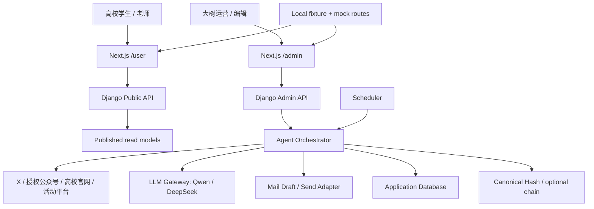
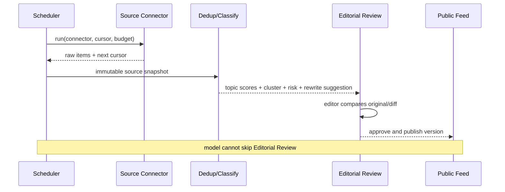
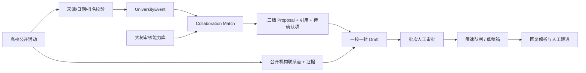

# ClawTree 初始架构（规划稿）

状态：Draft；本文件描述目标架构与演进边界，不代表所有组件已经实现。

## 1. 架构目标

1. 保住黑客松离线 Demo：无数据库、无 Key、无网络仍可走通黄金路径。
2. 复用当前 Django 真实采集原型，不再创建第三套后端。
3. 将 `/user` 公开发布面与 `/admin` 运营控制面隔离，避免邮箱、草稿和风险原文泄露。
4. 所有 Agent 步骤结构化、可追溯、可评测；模型不直接驱动发布、发送或上链。
5. 每项新增能力都能用 fixture 和 smoke test 验证，并可在外部服务失败时降级。

## 2. 当前与目标形态

| 层 | 当前 | 目标 |
|---|---|---|
| Web | Next.js `/`、`/demo`、`/admin` | 保留现有路由，新增独立 `/user` 与管理工作台 |
| 离线演示 | Next.js Route Handlers + `demo.json` | 继续作为稳定 fallback 与 smoke golden path |
| 业务后端 | Django 活动/推文模型、采集命令和 DRF API | 扩展为采集、审核、匹配、提案和外联控制面 |
| 任务调度 | 活动 cron 示例；推文无每日任务 | Scheduler → 管理命令 → `IngestionRun` |
| AI | 后端 OpenAI-compatible；客服有浏览器端原型 | 统一服务端 LLM Gateway、schema、评测、降级与成本记录 |
| 邮件 | 浏览器打开 Gmail/BCC 原型 | OAuth 草稿优先；一校一稿、审批、限速、幂等、退订 |
| Web3 | Solidity/Hardhat 与 mock proof | 只锚定公共摘要 hash；不阻塞核心业务 |

## 3. 系统边界

边界规则：

- Public API 只读已发布 read model，不直接序列化内部表。
- Admin API 才能看到联系点、风险原文、diff、提案和回复。
- 浏览器只拿短期会话，不持有 LLM、X、公众号、邮箱或链密钥。
- 外部网页内容一律视为不可信数据，不作为系统指令。

## 4. 内容接力站链路

采集按 `connector_id + external_id` 保证精确幂等，按规范化 hash/语义 cluster 处理跨来源重复。原文快照不可被 AI 覆盖；发布内容保存自己的版本、事实引用、审核人和来源更新时间。

公众号输入优先级：官方 API/开放平台 > RSS/官网同步 > 运营授权导出 > 人工投递。需要绕过登录、验证码或平台限制的方案不进入架构。

## 5. 高校机会与提案链路

匹配不是“模型觉得合适”的单分数。至少拆分主题、时间、地域、受众、资源和信息完整度，输出支持证据、冲突和缺失信息。提案只能引用审核能力库中的真实资源；奖金、嘉宾、曝光、投资或主办承诺都需显式人工确认。

## 6. Agent Runtime 与协议

推荐用一个可恢复的顺序编排器，而不是让多个自由对话 Agent 互相聊天：

| Step | 输入 | 结构化输出 | 失败降级 |
|---|---|---|---|
| collect | connector、cursor、预算 | raw item refs、next cursor | 保存错误，不推进游标 |
| classify | source snapshot、taxonomy | 分数、标签、理由、引用 | 规则分类或人工队列 |
| deduplicate | hash、候选 cluster | canonical ID、相似度、理由 | 只做精确去重 |
| compliance | 原文、品牌规则 | 风险、建议改写、diff | `needs_review`，不发布 |
| match | event、campaign、capabilities | 子分、契合点、缺失项、引用 | 规则模板 |
| propose | verified match | 三档合作包、风险、问题 | 固定提案模板 |
| draft | proposal、contact、brand voice | subject/body/citations/checks | 不创建待发消息 |
| approve/send | draft version、operator | audit event、provider result | 草稿箱或模拟发送 |
| reply triage | reply snapshot | intent、confidence、next action | `unknown + manual_review` |

每次 `AgentRun` 记录 prompt/schema 版本、模型、输入引用、输出、token、延迟、重试、工具调用、错误和人工反馈。输入正文与 PII 在日志中按字段脱敏。

## 7. API 与权限分层

### Public

- `GET /api/user/feed`
- `GET /api/user/events`
- `GET /api/user/recaps`
- `POST /api/user/assistant/chat`
- `POST /api/user/cooperation-leads`

Public serializer 只允许：已批准标题/摘要、公开图片引用、来源、时间、活动地点/报名链接和公开标签。禁止：联系邮箱、电话、内部评分、风险原文、模型 prompt、草稿、回复和人员画像。

### Admin

- connectors / ingestion runs
- content review / publish
- event verification / contact points
- matches / proposals
- outreach batches / approvals / replies

所有管理写操作保存操作者、输入版本、幂等键和审计 ID。发布、批次批准、发送和上链使用更高权限，并支持立即停止。

## 8. 数据与隐私

建议数据分区：

- `source_*`：原始公开来源快照、hash 和授权状态。
- `editorial_*`：主题、风险、diff、审核与发布版本。
- `campus_*`：机构、活动、公开联系点及证据。
- `growth_*`：campaign、match、proposal、outreach、reply。
- `agent_*`：run、eval、cost、feedback。
- `proof_*`：公共摘要 payload、hash、network 和 tx；不含 PII。

数据保留以最小必要为原则。退订、投诉或授权撤回会进入 suppression；公开内容撤回保留审计事件，但不继续对外展示。

## 9. 调度、可靠性与成本

- 每个 connector 配置时区、频率、单次页数、日预算和并发上限。
- 游标仅在原始快照成功落库后推进；失败任务指数退避，达到阈值告警。
- 每日运行有心跳；“运行成功但连续无内容”也需要异常提示。
- LLM 按批处理和缓存降低成本；先规则/精确 hash，再调用语义去重。
- 外部 API、模型、邮箱或 RPC 失败不影响 `/demo`；fixture 始终可完成路演。

## 10. 安全 Guardrails

1. 立即轮换任何曾进入前端或 Git 的模型/数据库等真实凭据，迁到服务端 secret，并在 CI 扫描 bundle 与仓库。
2. 网页文本只作为 data；系统 prompt、工具 schema 和域名 allowlist 不受网页内容修改。
3. 发布与发送均要求人工审批；高风险标签不能被批量忽略。
4. 邮件一校一信，带幂等键、速率、退订和熔断；不猜测个人邮箱。
5. 合规编辑保留原文与 diff，不改变事实，不用于规避规则。
6. 世界杯内容禁用博彩入口、收益承诺、荐股和结果保证；素材记录许可。
7. Proof 使用字段 allowlist；任何 email/body/contact/reply/name/prompt 都不能进入链上 payload。

## 11. 可测试性

每个工作包必须提供：

- fixture：稳定复现成功、重复、过期、风险和失败样本。
- domain test：状态机、字段 allowlist、幂等、引用和权限。
- API test：schema、错误格式、鉴权与无副作用默认值。
- smoke：从触发到可观察结果的最短主流程。
- eval：内容分类、去重、提案引用、客服拒答等黄金集。

未能自动验证的新增能力不进入默认 Demo。

## 12. 推荐实现顺序（需产品决策后执行）

1. 安全门：密钥轮换、服务端 LLM gateway、public/admin serializer 边界。
2. Content Relay：运行记录、每日 X 增量、编辑状态机、`/user/recaps`。
3. Opportunity Radar：活动质量与 `ContactPoint` 证据化、`/user/events`。
4. Proposal Agent：能力库、match/proposal schema、离线黄金样本。
5. Outreach：草稿箱、审批、限速、幂等、退订、回复。
6. 公众号与真实链作为独立适配器；没有授权或稳定性时继续用人工导入/mock。
