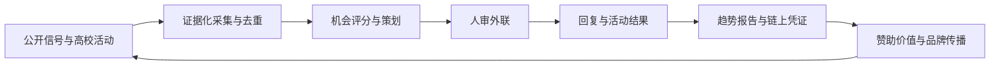
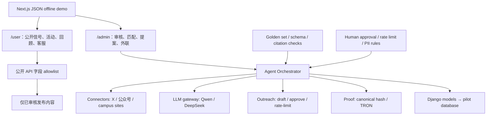
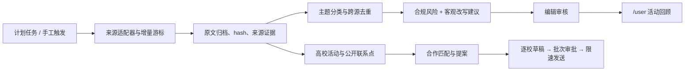

# ClawTree 快速入门背景

## 1. 我们到底要做什么

ClawTree 不是另一个活动黄页，也不是“套了聊天框的高校数据库”。它是给大树财经活动、内容和生态团队使用的 **AI 媒体活动增长操作系统**：持续发现高校与公共热点信号，判断哪些值得大树参与，把机会转成内容策划、合作对象和个性化外联，再将执行结果沉淀成可复用数据。

一句更锋利的表达是：

> 把分散的高校与热点信号，在 15 分钟内变成可审核的选题、合作名单和个性化外联，并用链上哈希证明执行结果。

这个定位比“高校活动聚合平台”更符合大树财经的实际商业角色。大树的优势不是拥有最多活动链接，而是内容能力、媒体分发、嘉宾网络、产业合作和高校触达。ClawTree 要放大这些资产，最终成为大树可出售、可复制的增长服务能力。

产品最终分成清晰的两端：

- **用户端 `/user`**：给高校老师、学生和参与者看经过审核的校园信号、高校活动、大树活动回顾、平台能力和合作入口，并提供有依据的 AI 客服。
- **管理端 `/admin`**：给大树运营和编辑看采集运行、内容审核、活动与公开合作邮箱、匹配提案、外联审批和回复漏斗。

当前仓库已经有 `/admin`、活动采集、TreeFinance 推文采集/筛选/去重、活动回顾和 AI 客服原型；独立 `/user`、每日推文调度、公众号适配、提案 Agent 与可靠邮件管道仍是待选择任务。文档中的“规划中”不代表代码已经实现。

## 2. 已核验的外部背景

截至 2026-07-03，用户提供的公开动态体现了四类相互加强的动作：

1. **高校巡讲正在形成系列 IP。** 大树财经与 ATM 宣布中国高校行第五站于 7 月 18 日落地广州，主题是“数实共生，连接万象”，并联合金色财经、Twinkle、非小号等伙伴。
2. **AI × Web3 黑客松和 WAIC 是近期强节点。** 大树支持 HTX Genesis Hackathon，并承诺在 7 月上海 WAIC 总决赛提供媒体与生态支持。
3. **高校行可以先在线上完成内容和线索验证。** 金色财经、大树财经等以 X Space 形式围绕 AI 数据资产、数据确权举办全球高校行 AMA。
4. **世界杯是可借势的财经内容入口。** 大树参与以“重大事件如何驱动全球资产机会”为主题的 X Space。真正有价值的不是蹭球赛流量，而是把热点转为财经素养、预测市场、数据权益和 AI Agent 决策等议题。

来源：

- [全球高校行 AMA：AI 数据资产与确权](https://x.com/JinseFinance/status/2069618254973370698)
- [大树财经 × ATM 广州高校行第五站](https://x.com/TreefinanceCN/status/2071559653612552638)
- [大树财经支持 HTX Genesis Hackathon / WAIC](https://x.com/TreefinanceCN/status/2069611885700489685)
- [世界杯热点与事件驱动市场讨论](https://x.com/TreefinanceCN/status/2069216265152188895)

这些公开内容只作为产品方向依据和 Demo 数据样例；真实上线时仍需通过官方 API 或获得授权的数据源定期校验。

## 3. 用户痛点为什么值得解决

当前团队的问题不是“找不到任何活动”，而是信息到行动之间有大量断点：

- 来源散落在校官网、公众号、X、报名平台、社群和合作伙伴账号，检索结果无法直接进入工作流。
- 同一活动存在转载、日期变更和过期信息，团队不敢直接使用 AI 汇总。
- 运营人员需要重新阅读材料、找联系人、写合作角度、改邮件、记进度，重复劳动吞噬高价值时间。
- 内容、活动和商务团队各自维护表格，成功合作没有变成下一次可复用的“组织记忆”。
- 全自动群发会损害品牌；纯人工又无法规模化。真正需要的是有证据、有审批、有节流的半自动工作流。
- 赞助方很难看到“媒体支持”如何转化为高校覆盖、内容产出、报名和合作线索。

## 4. 第一场世界级 Demo

Demo 讲一个连续故事，而不是展示五个互不相干的页面：

**场景：世界杯期间，大树准备广州高校行。**

1. Signal Scout 发现三个证据：世界杯事件驱动财经讨论升温、广州高校行已确定、AI 数据资产话题在高校受关注。
2. Opportunity Planner 提议一场“世界杯 × AI：事件驱动市场与数据权益”校园内容单元，并解释它如何服务高校、品牌方和大树。
3. Match Agent 从候选高校中选出具备财经、计算机、区块链社团或国际传播资源的目标，给出可解释评分。
4. Outreach Copilot 生成只引用已核验事实的个性化邀请；运营人员修改、批准后模拟发送。
5. Reply Triage 把模拟回复归类为“有意向 / 需补充信息 / 暂不考虑”，建议下一步行动。
6. Proof Anchor 对活动 brief、使用的来源 ID、批准记录和结果摘要做规范化哈希并模拟锚定到 TRON Nile。联系人和邮件正文不上链。
7. Trend Studio 由整个活动漏斗生成赞助方可读周报：覆盖高校、已核验机会、批准外联、正向回复和潜在内容主题。

可选的双端开场先让老师在 `/user` 看见“大树做过什么、最近有哪些活动、我校能怎样合作”，再切到 `/admin` 展示同一批公开证据如何变成逐校提案。这样 Demo 不只讲内部省时，也现场证明高校一侧的获取与转化价值。

评委在 3 分钟内看到的核心价值是：**AI 不只是写邮件，而是在可信来源约束下完成增长决策；Web3 不只是连钱包，而是让跨组织协作结果可验证。**

## 5. 产品飞轮

护城河不是爬虫数量，而是逐渐积累的“什么选题、什么高校、什么合作方案能获得回复并形成活动”的反馈数据。

## 6. 对资金方和大树财经的价值

### 对大树财经

- 将高校行从项目制变成可复制的城市/主题 campaign 模板。
- 同一份信号同时产出活动、X Space、采访、趋势周报和赞助提案，提高内容复用率。
- 团队只处理高分机会和需要判断的沟通，减少搜集与初稿时间。
- 用统一漏斗向管理层解释媒体与生态支持的成果。

### 对赞助方与投资人

- 可看到从预算到高校覆盖、活动和线索的可验证路径，而不是模糊曝光量。
- 可围绕城市、赛道或人群购买 campaign，例如“湾区高校 AI Agent 月”。
- 数据资产可以扩展到活动趋势 API、人才雷达与生态 scouting，但 MVP 不提前承诺交易市场。

### 商业化顺序

1. 大树内部效率工具与广州站试点。
2. 面向黑客松、协议和 AI 平台的赞助 campaign 工作台。
3. 面向媒体/高校创新中心的 SaaS 席位与趋势报告。
4. 在有稳定数据和同意机制后，再评估人才或数据协作网络。

## 7. 技术架构：保留离线黄金路径，逐步接入真实后端

默认黑客松黄金路径继续使用 Next.js 和本地 JSON，避免现场依赖外网。Django 现在已经承载真实原型能力，包括高校活动与 TreeFinance 推文采集、筛选、去重和管理 API；它不是默认离线 Demo 的依赖，但也不应另起一套重复后端。新能力优先沿 Django 模型/API 演进，并通过同一接口提供 fixture 降级。

真实内容链路规划为：

完整 Agent 工程不是堆多个会说话的 Agent，而是六件可测的事：

- **Context**：campaign brief、来源证据、组织画像和品牌规则。
- **Runtime**：有状态的顺序编排；失败可重试，步骤可恢复。
- **Tool Protocol**：采集、检索、草拟、发送、通知和锚定使用明确输入输出。
- **Structured Output**：每一步使用 JSON Schema/Zod 类结构，禁止自由文本直接驱动工具。
- **Eval**：固定 20 条黄金样本评测事实一致性、引用覆盖、意图分类和个性化质量。
- **Guardrails**：来源白名单、人审、速率限制、退订、PII 脱敏、提示注入隔离。

## 8. 模型和 API 选择

- 主模型建议 Qwen（阿里百炼 OpenAI-compatible API），中文、成本和企业可用性均适合作为默认。
- DeepSeek 用作低成本抽取/分类或模型降级。关键输出不在运行时做“双模型互相辩论”，避免延迟和费用失控。
- Codex 用于开发、测试、数据 fixture 和评测集维护，不作为生产运行依赖。
- X、Google 和校官网采集必须保存原始 URL、抓取时间和内容哈希；无法验证的内容标记为 `unverified`。
- 公众号优先官方 API、RSS、授权导出或人工投递；不把绕过登录、验证码或平台限制作为实现方案。
- 邮件真实发送优先 OAuth 与草稿箱模式；MVP 不接收 SMTP 明文密码。
- 所有模型调用必须发生在服务端；前端 bundle 中不得出现 API Key。仓库现有客服原型需要先完成密钥轮换与服务端迁移，才可公开部署。

## 9. 现在不要做的诱人东西

- 不做通用社交网络、学生社区或完整 CRM。
- 不做自治群发 Agent。
- 不用一封 BCC 拼接正文冒充逐校个性化；批量只代表批量生成和审批。
- 不把“去敏感词”用于绕规则或改变事实；原文、建议改写和 diff 必须可审计。
- 不把个人邮件、回复、简历或联系人上链。
- 不做交易建议、体育投注或自动管理资金。
- 不在 72 小时内同时维护 Django、Next、移动端和多链生产部署。
- 不把“50+ 活动”当核心成功；一个可信、可复现的闭环比一堆不可验证链接更有说服力。

## 10. 阅读顺序

1. 本文理解为什么做。
2. 阅读 [prd.md](prd.md) 确认做什么和不做什么。
3. 阅读 [architecture.md](architecture.md) 理解公开端、管理端、采集、Agent 和外联边界。
4. 阅读 [acceptance.md](acceptance.md) 看如何证明完成。
5. 按 [tasks.md](tasks.md) 的决策门与任务顺序实现。
